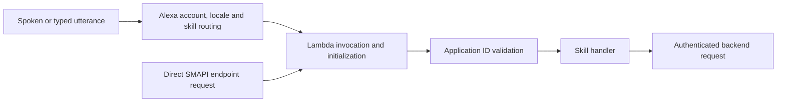

# Alexa invocation failure: history, routing and current evidence

Research date: 2026-10-02, Europe/Madrid. Repository: `spoken-letter-alexa`. Worktree: `/Users/juan/code/spoken-letter-alexa`. Research branch: `develop`, commit `afe33edb69eb0f017f62eb9a9faa348c864b5572`. Last verified published runtime: `c46be917a1c82d02dfc1dfd761b0c41d69e13ec9`, verified October 1, not refreshed as an AWS health claim on October 2.

Scope: `/rpi-research` and primary-source web research. Trace the last successful operation, subsequent executed actions, first retained failure and possible failure boundaries. No product implementation, deployment, enablement reset, account-setting change or external support submission is part of this research. The Owner expressly requires approval before changing Amazon.es account settings.

## Answer supported by the evidence

The retained history does not show a continuously working skill that first broke after the October 1 repairs. Full ASK invocation succeeded on September 28, failed on September 29 with the same Lambda artifact, was later reported working by the Owner, and reached playback callbacks on September 30. October 1 direct endpoint tests passed while full Alexa invocation failed. October 2 console invocation still failed. This is evidence of recurring failure across different artifacts, with a reported recovery between failures; it does not identify the cause of recovery or prove that all failures share one root cause. Evidence: `.rpi/local/alexa-invocation-research-2026-10-02/evidence.md:11`, `:12`, `:19`, `:21`; `/tmp/alexa-session-2026-09-30/skill-structured.json:163`, `:179`; `.rpi/local/alexa-session-friction/deployment-2026-10-01/final-simulator-proof.json:5`; `.rpi/local/alexa-service-retry-2026-10-02/report.json:7`.

The October 1 source changes cannot have introduced the already recorded September 29 symptom. The strongest current inference is a failure in the normal Alexa invocation path, potentially involving account, locale, stage or Amazon dispatch. That inference is supported by successful direct endpoint calls, failed full simulations and one failed simulation window with zero observed skill/API log events. It is not a confirmed Amazon outage or a conclusive exclusion of every Lambda-entry failure. Evidence: `docs/agents/alexa-invocation-2026-09-29/diagnosis.md:12`, `:26`; `docs/plans/2026-10-01-alexa-session-friction-notes.md:121`, `:123`; `packages/skill/src/lambda.ts:16`; `packages/skill/src/handler.ts:308`.

A fresh browser observation establishes that the retail account currently open in the browser has Spain as its country/region. The repository supports `en-US` and declares US distribution. This is a concrete account/locale lead, not proof that Spain caused the development invocation failure. The retail identity has not been bound to the developer login or failing Echo, and no account history establishes when that country setting changed. Evidence: `.rpi/local/alexa-invocation-research-2026-10-02/evidence.md:29`; `packages/skill/skill-package/skill.json:5`, `:24`; [Amazon locale and distribution documentation](https://developer.amazon.com/en-US/docs/alexa/custom-skills/develop-skills-in-multiple-languages.html).

## Last successful operations and first failures

All times below are Madrid time, UTC+02:00. Transcript dates are recording times; the exact hardware event time is unavailable unless stated. The local evidence index retains the original transcript paths and line numbers without copying private raw requests into this public document.

| Date and time | Observation | What this proves | Evidence |
| --- | --- | --- | --- |
| Sep 28, 22:29:43 | Full ASK dialog: open skill, start a story, supply a forest theme, receive saved demo draft response. | Normal development invocation and the draft path worked in this ASK session. No Echo audio acceptance claim. | Local evidence index `:11`–`:12`. |
| Sep 29, 18:37:19 | Owner reported the skill was unsupported on an Echo Show 5. | Hardware failure was reported before the investigation's repair actions. | Local evidence index `:16`. |
| Sep 29, 18:40:58–18:41:50 | `FORCE_NEW_SESSION`, development, `en-US`, `open spoken letter`: terminal `FAILED`, unexpected error. | First retained full-simulation failure. Lambda still had the September 28 code hash. | Local evidence index `:17`–`:19`. |
| Sep 29, 18:46 | Direct SMAPI `StartStoryIntent` returned the theme prompt in 699 ms. | The endpoint could execute despite normal invocation failure. | `docs/agents/alexa-invocation-2026-09-29/diagnosis.md:12`. |
| Sep 29, 18:50–18:56 | Refresh, unchanged model rebuild, disable/re-enable succeeded administratively; full simulation still failed. | Those operations did not establish immediate recovery. | Local evidence index `:20`; historical diagnosis `:22`–`:26`. |
| Sep 29, 20:06:14 | Owner said the skill now worked. | Reported recovery; device/test surface and causal action unspecified. | Local evidence index `:21`. |
| Sep 30, 20:13:43–20:13:59 | `PlayAllIntent`, `played: true`, followed by `AudioPlayer.PlaybackStarted` and `PlaybackStopped`. | Latest retained evidence that the playback request/callback path operated. Logs do not identify the exact Echo or prove what the Owner heard. | `/tmp/alexa-session-2026-09-30/skill-structured.json:163`, `:179`, `:193`. |
| Oct 1, 14:20–14:23:26 | Repaired Lambda and ASK model published; subsequent full dialog failed. | Administrative publication succeeded, invocation acceptance did not. | Local evidence index `:23`; `.rpi/local/alexa-session-friction/deployment-2026-10-01/ask-deploy.log:18`–`:22`; phase notes `:90`–`:94`. |
| Oct 1, 17:17:28–17:18:56 | Final full simulation failed; 88.470-second window contained zero observed skill/API log events. | No endpoint arrival was observed in this captured window. This is stronger than missing `skill_turn` alone, but remains a bounded log observation. | `.rpi/local/alexa-session-friction/deployment-2026-10-01/final-simulator-proof.json:5`–`:15`. |
| Oct 2, approximately 07:41–07:43 | Open/help invocations returned a service-interruption reply; a general English-US time request succeeded. | Failure persisted in that console session while a general Alexa request worked. Current Echo acceptance remains unverified. | `.rpi/local/alexa-service-retry-2026-10-02/report.json:2`, `:7`–`:29`. |

The September 28 successful artifact had code SHA-256 `UokyEDtWKSzr6zEL3/G+1/LVe2gJqQcIgnas7idRt0s=` and was last modified at 20:14 UTC. September 29 metadata read the same identity before the failed simulation. September 30 metadata instead records `jfXm41y7FFVuuLabJMgzCeRLyykouZTx7FbqybeloXE=` following the September 29 wording deployment. The published October 1 artifact is `uqb+8HuEXkyHyrja4L0vQceirhcCdQQpOVvpRU7isyg=`. Evidence: local evidence index `:11`, `:17`, `:22`; `/tmp/alexa-session-2026-09-30/sla-alexa-skill-metadata.json:2`; `.rpi/local/alexa-session-friction/deployment-2026-10-01/aws-proof.json:5`–`:11`.

## Executed actions after the last September 28 success

| Time/date, Madrid | Action actually recorded | Relationship to first failure |
| --- | --- | --- |
| Sep 28, 22:30:14 | Removed two verified task-owned S3 staging objects and their temporary bucket; aborted one exact stale CDK multipart upload. | Only recorded external mutation in this interval. These were staging resources. No evidence connects cleanup to the next day's failure. |
| Sep 28, 22:30–22:31 | Edited evidence documents, committed `869a5ba`, fast-forwarded local `develop`, deleted the fix branch. | Local Git/document operations did not publish another runtime or model. |
| Sep 29, before 18:40:58 | Read source, Git refs, AWS logs/configuration/policy, ASK metadata/status/enablement; opened console pages. | No configuration write recorded before the first full-simulation failure; the Owner's device report preceded these reads. |
| Sep 29, 18:50–18:53 | Refreshed enablement, rebuilt the unchanged model, disabled/re-enabled development. | Performed after failure began. The immediate retries still failed; later Owner-reported recovery cannot be attributed to these actions from the retained evidence. |
| Sep 29, 21:05:41 | Published customer-wording changes. | After both first failure and Owner-reported recovery. September 30 playback subsequently reached callbacks. |
| Oct 1 | Implemented and published session recovery, diagnostics and six console-discovered behavior/model repairs; refreshed enablement. | Later actions could affect later behavior, but cannot explain the original September 29 onset. Full invocation remained unresolved after publication. |

Evidence: local evidence index `:13`–`:23`; `docs/plans/2026-10-01-alexa-session-friction-notes.md:86`–`:123`. The bounded September 28 interval contains no subsequent Lambda/CDK deployment, ASK import, enablement write or account-setting change. This is a statement about the captured session, not an audit of all actors or Amazon-side changes.

## Invocation boundaries and why the green tests differ

The classic custom skill points directly to `sla-alexa-skill` in `us-east-1`; it is not the Alexa+ MCP add-on client path. The manifest supplies a default endpoint and AudioPlayer. CDK grants `alexa-appkit.amazon.com` invocation tied to the configured skill ID. The invocation name remains `spoken letter`. Evidence: `packages/skill/skill-package/skill.json:31`–`:41`; `infra/lib/skill-stack.ts:173`–`:178`; `packages/skill/src/model/generate.ts:23`; `packages/skill/src/lambda.ts:1`–`:7`.

Before handler telemetry starts, module initialization checks environment values and retrieves the command secret. The handler also rejects a missing/wrong application ID before its telemetry state is created. Therefore absent structured turn telemetry alone cannot prove that Alexa never invoked Lambda. These boundaries are unchanged from the working baseline. Evidence: `packages/skill/src/lambda.ts:16`–`:23`; `packages/skill/src/handler.ts:308`–`:319`; local evidence index `:36`.

Launch calls the demo-update endpoint, with a welcome response on caught dependency failure. It does not need story-generation inference to return its first prompt. Thus a story-generation failure is not a sufficient explanation for an invocation that never reaches this code. Evidence: `packages/skill/src/handler.ts:348`–`:366`.

Amazon documents the Skill Invocation API as a call to the Lambda/HTTPS endpoint. It differs from natural-language simulation. The October 1 software acceptance used utterance profiling and direct endpoint requests with synthetic session/state control; it verified 16 cases, 106 turns and 982 assertions, not spoken invocation routing or Echo playback. Evidence: [Skill Invocation API v2](https://developer.amazon.com/en-US/docs/alexa/smapi/skill-invocation-api.html); `docs/plans/2026-10-01-alexa-session-friction-notes.md:121`–`:123`. A successful model build or CLI process exit also does not override a terminal simulation `FAILED`; [Skill Simulation API](https://developer.amazon.com/en-US/docs/alexa/smapi/skill-simulation-api.html) defines the terminal result separately.

## Possible causes and what is actually isolated

| Candidate | Supporting or contrary evidence | Disposition |
| --- | --- | --- |
| October 1 theme/reprompt/diagnostic implementation introduced the original symptom | September 29 failed on the September 28 artifact. New branches run after invocation. | Excluded as the cause of that earlier onset; later regressions are not categorically excluded. |
| A changed invocation name, locale, default endpoint or new account restriction in our revisions | Those registration fields match across `869a5ba`, `be03dd1`, `c46be917`, `afe33edb`. No new personalization/account-linking gate was found. | No supporting source-change evidence. |
| Account/locale/stage routing or skill-specific Amazon failure | Full routing failed while endpoint tests worked. Browser retail country is Spain, skill locale is en-US. General English console request worked today. | Plausible unresolved boundary; account/device identity and actual region are not bound. |
| Missing Europe-specific endpoint | A default endpoint exists. Amazon documents falling back to default when the preferred regional endpoint is absent. | Absence of a separate EU endpoint is not sufficient evidence of failure. |
| Hidden/removed duplicate invocation or live-version routing | Amazon documents both failure patterns. Historical vendor inventory showed one skill with this public name, but did not compare every invocation name or hidden/live enablement. | Unresolved, not ruled out by public-name inventory. |
| Personalization banner | Current Skills Personalization checkbox is off; manifest has no personalization declaration; handler has no recognized-speaker gate. | Banner alone is not evidence of the cause. |
| Browser session interference | Amazon does not support simultaneous simulator tabs. The fresh retry coexisted with an older test tab. Earlier standalone CLI force-new simulations also failed. | Limitation of the browser retry; insufficient explanation for all observations. |
| Lambda permission, initialization or secret/config drift | October 1 deployed files matched the candidate and functions were Active/Successful. Entry failures can precede handler logs; current project logs could not be retrieved today. | Current drift remains unmeasured. |
| A broad, transient Alexa outage | No primary-source incident confirmation found. Generic service text is nonspecific; a general English console query succeeded. Failure/recovery/re-failure spans several days. | Not established; waiting alone has not established recovery. |

Repository evidence: local evidence index `:35`–`:38`; `packages/skill/skill-package/skill.json:43`–`:62`; `packages/skill/src/handler.ts:308`; `.rpi/local/alexa-session-friction/deployment-2026-10-01/aws-proof.json:3`–`:25`; `.rpi/local/alexa-service-retry-2026-10-02/report.json:7`–`:30`. Primary-source descriptions: [locale/endpoint fallback](https://developer.amazon.com/en-US/docs/alexa/custom-skills/develop-skills-in-multiple-languages.html), [duplicate and live-version troubleshooting](https://developer.amazon.com/en-US/docs/alexa/devconsole/troubleshoot-your-skill.html), [personalization testing](https://developer.amazon.com/en-US/docs/alexa/custom-skills/test-personalization-alexa-simulator.html), [simulator limitations](https://developer.amazon.com/en-US/docs/alexa/devconsole/alexa-simulator.html).

## Account, location and language findings

Physical presence, device language and account marketplace are distinct inputs. Amazon documents language independently of physical location, region-dependent endpoint selection with default fallback, and published skill availability using distribution, device language and marketplace conditions. Changing device language does not itself change the account's skill catalog. These published-store rules do not by themselves prove that an enabled development skill must fail for a Spanish account. Source: [Develop Skills in Multiple Languages](https://developer.amazon.com/en-US/docs/alexa/custom-skills/develop-skills-in-multiple-languages.html).

The official Amazon.com Content and Devices page directed the current retail browser account to Amazon.es. Its Spain preferences page explicitly showed current country/region Spain. This was a read-only observation; the shopping-site selector was not used as proof. No country, address, language, device registration, privacy or permission setting was changed. The Owner's report that Spanish works remains testimony whose scope is unclear: ordinary Alexa requests versus this en-US-only custom skill. Evidence: local evidence index `:29`–`:31`; `packages/skill/skill-package/skill.json:5`.

The Alexa+ development setup has its own marketplace/locale requirements. They apply to that add-on environment and cannot simply be transferred to this classic ASK Lambda failure. Source: [Alexa+ development environment](https://developer.amazon.com/docs/alexaplus/add-ons/set-up-your-development-environment.html); classic registration evidence: `packages/skill/skill-package/skill.json:31`.

## Existing recovery mechanisms and observed results

The developer console and enablement API provide development/live stage selection and enable/disable operations. These are visible developer controls, not the generic error's user-facing recovery instructions. September 29 refresh, rebuild and full disable/re-enable returned administrative success without an immediately successful invocation. October 1 enablement/model success also did not resolve the final full simulation. Evidence: historical diagnosis `:22`–`:26`; phase notes `:92`, `:123`; [console testing](https://developer.amazon.com/en-US/docs/alexa/devconsole/test-your-skill.html), [Skill Enablement API](https://developer.amazon.com/en-US/docs/alexa/smapi/skill-enablement.html).

Inside the handler, a caught launch dependency failure returns the existing welcome/reprompt, with failure diagnostics. Invalid application identity or module-init configuration failures instead throw before that fallback. The source's missing-SKILL_ID error describes deploying the skill and redeploying with its ID; those are operational controls, not instructions spoken to the customer. Evidence: `packages/skill/src/handler.ts:360`–`:366`; `packages/skill/src/lambda.ts:18`–`:23`.

Amazon documents account/marketplace verification, removing competing enabled skill versions and developer support cases as existing troubleshooting paths. Country changes are consequential account operations and were not performed. No support case, chat message or community post was sent. Sources: [console troubleshooting](https://developer.amazon.com/en-US/docs/alexa/devconsole/troubleshoot-your-skill.html), [developer account management](https://developer.amazon.com/en-US/docs/alexa/developer-account/manage-developer-account.html), [Alexa developer support](https://developer.amazon.com/en-US/docs/alexa/ask-overviews/contact-us.html).

## Evidence limits and continuation handoff

Finding R1, resolved: the first retained failure predates October 1 implementation. Finding R2, resolved: latest success depends on the layer being measured: full ASK dialog September 28, Owner-reported recovery September 29, playback callbacks September 30, endpoint software acceptance October 1. Finding R3, unresolved: the precise current invocation cause. Finding R4, resolved observation with unresolved attribution: retail browser country Spain; Echo/developer account binding and setting-change date unknown.

Current native verification has an access gap. Fresh CLI AWS/curl reads could not connect under this session's network restrictions. ASK CLI needs read/write access to `~/.ask/cli_config`, outside the allowed writable roots. Browser CloudWatch opened successfully but is authenticated to a different account from the project account. It did not verify project logs. These are agent access limits, not evidence that AWS or Alexa is down. No sign-out, account switch or credential change was performed. Evidence: local evidence index `:28`, `:38`; retry report `:27`–`:28`.

The practical blocker is full Alexa invocation and hardware acceptance, not all repository work. October 1 local gates passed on `afe33edb` and runtime/model identity matched `c46be917`; those are historical receipts, not fresh October 2 health checks. Source remained unchanged during this research. Evidence: `.rpi/local/alexa-session-friction/deployment-2026-10-01/closeout-verification.json:7`–`:67`; `aws-proof.json:2`; `amazon-identity.json:2`–`:11` in that same directory.

Unresolved facts needed for a causal conclusion are the failing Echo's exact English locale, registered account and Alexa/classic mode; whether Spanish success included Spoken Letter; a timed full invocation paired with current project Lambda logs including initialization failures; current development/live enablement and competing invocation names; and any Amazon-side incident or account-setting change in the failing intervals. None is replaced by a green endpoint response. Resume by revalidating checkout/runtime and account identity against this dated record. Any Amazon.es setting change requires the Owner's explicit prior approval. No planning or implementation was begun in this research.

Research method: reused valid source reads, compared Git history and retained deployment/simulation evidence, and inspected three bounded independent read-only assignments covering timeline, source changes and artifact consistency. All assignment results were reviewed. With Graphify MCP unavailable, queried the repository's own `graphify-out/graph.json` read-only, then confirmed source. Index identity matched `afe33edb`, with 2,703 nodes and 5,403 links. Raw inventories and transcript provenance remain under `.rpi/local/alexa-invocation-research-2026-10-02/`, ignored by Git. Evidence: local evidence index `:7`–`:9`, `:37`–`:39`.

## External source provenance

All primary pages were opened and retrieved on 2026-10-02. Search included Amazon developer documentation/support discussions, locale/stage routing, the exact generic failure, and October 1–2 outage reports. No primary source confirmed a matching current incident. The public AWS Health page returned no usable text in the web tool; it is not an outage verdict. Third-party status anecdotes were not used to assign root cause.

| Primary source | Exposed update/version | Use |
| --- | --- | --- |
| [Console testing](https://developer.amazon.com/en-US/docs/alexa/devconsole/test-your-skill.html) | Mar 20, 2024 | Stage/enablement and direct Manual JSON semantics. |
| [Alexa Simulator](https://developer.amazon.com/en-US/docs/alexa/devconsole/alexa-simulator.html) | Aug 17, 2026 | Multiple-tab and audio/reprompt limitations. |
| [Skill Simulation API](https://developer.amazon.com/en-US/docs/alexa/smapi/skill-simulation-api.html) | Aug 1, 2024 | Force-new session and terminal-result semantics. |
| [Skill Invocation API](https://developer.amazon.com/en-US/docs/alexa/smapi/skill-invocation-api.html) | v2; Aug 1, 2024 | Endpoint test boundary. |
| [Skill Enablement API](https://developer.amazon.com/en-US/docs/alexa/smapi/skill-enablement.html) | Jul 14, 2026 | Enabled state is administrative evidence. |
| [Console troubleshooting](https://developer.amazon.com/en-US/docs/alexa/devconsole/troubleshoot-your-skill.html) | Apr 23, 2024 | Duplicate names, live-version routing, marketplace. |
| [Multiple languages](https://developer.amazon.com/en-US/docs/alexa/custom-skills/develop-skills-in-multiple-languages.html) | Jul 15, 2024 | Locale, default endpoint and store distribution. |
| [Developer account management](https://developer.amazon.com/en-US/docs/alexa/developer-account/manage-developer-account.html) | Jul 1, 2024 | Marketplace setting location. |
| [Personalization simulator testing](https://developer.amazon.com/en-US/docs/alexa/custom-skills/test-personalization-alexa-simulator.html) | Nov 29, 2023 | Optional personalization control context. |
| [Alexa+ development setup](https://developer.amazon.com/docs/alexaplus/add-ons/set-up-your-development-environment.html) | Jul 15, 2026 | Separate add-on environment requirements. |
| [Alexa developer support](https://developer.amazon.com/en-US/docs/alexa/ask-overviews/contact-us.html) | Sep 2, 2026 | Existing support channel; no submission made. |

## Recovery continuation: October 2, 06:23–06:25 UTC

A fresh reproduction used a single Test tab, with the older Test tab moved to Build. At 06:23:34.835 UTC, `open spoken letter` returned the temporary-service-unavailability message at 06:23:37.707 UTC. Skill I/O remained empty. The Device Log's RequestProcessingCompleted payload was empty; the Speak directive contained the generic error without a more specific cause. This reproduces failure without the earlier multiple-Test-tab confound.

A Manual JSON LaunchRequest with timestamp 06:24:14.790 UTC then returned `SUCCESSFUL` from the registered default Lambda endpoint. Its response described a fixture family birthday update. This demonstrates that the current handler and its authenticated backend update path executed for that synthetic request; it does not establish normal Alexa routing or Echo acceptance. At 06:25:23.591 UTC, the same console session also answered the ordinary request `what time is it`. The returned time is not evidence of the Echo's timezone.

Read-only console inspection showed development testing enabled, the expected default `sla-alexa-skill` endpoint in us-east-1, empty optional regional overrides, and account linking disabled. Developer-account administrator access was verified without recording personal identity details in this public report. This does not prove the Echo is registered to that same account.

Fresh AWS CLI diagnostics failed DNS resolution for the regional STS hostname. The project AWS console remained at sign-in, and automated interaction with its login fields detached. The Owner was asked to complete sign-in so the timed invocation can be compared with current Lambda initialization and invocation logs. These access failures provide no evidence of an AWS outage. No Amazon.es settings changed.

A private Amazon support case draft records the failing dialog identifiers and these successful controls. Submission requires the Owner's explicit approval to send a message on their behalf. No case was submitted as of this continuation. The precise dispatch failure remains unresolved; no speculative deployment or account migration was performed. Private receipts: `.rpi/local/alexa-recovery-2026-10-02/current-checks.json` and `amazon-support-case.txt` in that directory.

## Fresh-session AWS and ASK verification, completed October 2, 07:02 UTC

The earlier AWS/ASK access gap is resolved in this session. STS succeeded with profile `archy`, account `106403001709`, identity `arn:aws:iam::106403001709:user/archy`. No console sign-in, credential replacement or account switch was needed. Repository remains on `develop` at `afe33edb69eb0f017f62eb9a9faa348c864b5572`. These reads supersede the earlier access limitation; they do not establish Echo acceptance. Raw receipts and a machine-readable summary are in `.rpi/local/alexa-recovery-2026-10-02/fresh-aws/`.

The complete CloudWatch log query for 06:20:00–06:27:00 UTC returned five skill events and eight API events. No event appears at the failed normal invocation at 06:23:34–06:23:37. Skill initialization begins at 06:24:25.743; one LaunchRequest starts at 06:24:26.125 and completes successfully with `responseKey=updates` at 06:24:28.777. This timing and response agree with the retained direct endpoint control. Its handler reports 2,650 ms, Lambda duration 2,711.01 ms and initialization 377.80 ms. The API initializes and completes two requests in the same interval. No initialization error or runtime exception appears. Source receipts: `skill-logs.json` and `api-logs.json` in the fresh evidence directory.

Independent one-minute Lambda metrics contain one invocation in the 06:24 UTC bucket, zero errors and zero throttles in that bucket, and no datapoints for the other minutes of the captured interval. This supports the absence of an executed Lambda request for the failed 06:23 invocation. Missing datapoints are not presented as explicit zero-valued samples. Metrics cannot identify an Amazon-internal routing or pre-execution authorization failure. Source receipts: `metric-Invocations.json`, `metric-Errors.json`, `metric-Throttles.json`.

Current skill and API functions are Active with Successful last-update status. Their code hashes and last-modified times match the October 1 publication receipt. The skill environment names the expected skill ID. Its resource policy permits `alexa-appkit.amazon.com` to invoke the expected Lambda with `lambda:EventSourceToken` equal to that skill ID. No reserved-concurrency value was returned. These are current configuration observations, not proof of every effective permission or account-wide quota. Source receipts: `skill-config.json`, `api-config.json`, `skill-policy.json`, `skill-concurrency.json`.

ASK CLI 2.30.7 from the skill workspace works in this session. Development enablement returns HTTP 204 for its authenticated customer, the live-stage lookup returns HTTP 404, and the complete vendor inventory lists Spoken Letter only in development. Amazon documents 204 as enabled for the specified customer/stage and 404 as skill or stage not found: [Skill Enablement API](https://developer.amazon.com/en-US/docs/alexa/smapi/skill-enablement.html). The fetched development manifest points to the expected Lambda; all four model-build steps report SUCCEEDED. The fetched en-US model is semantically identical to the local generated JSON and retains invocation name `spoken letter`. Source receipts: `enablement-development.json`, `enablement-live.stderr`, `vendor-skills.json`, `manifest-development.json`, `skill-status.json`, `model-0598e354-ee92-413f-940a-61e4a6a0a2a7-development.json`, `summary.json`.

No competing `spoken letter` invocation appeared in retrieved models. This comparison remains partial: two older en-US model reads returned 404 and both Mission First stage responses omit invocationName. The inventory also cannot enumerate every third-party skill enabled on the retail account. A bounded SMAPI development-audit query returned HTTP 400 and supplied no additional audit evidence. Failures are retained; neither check is claimed complete. Source receipts: `invocation-names.json`, associated model responses/errors, `audit-window.stderr`.

The new evidence supports a failure before execution of the configured Lambda for the captured normal invocation. It does not identify whether the cause is account/locale resolution, Alexa dispatch, or another pre-execution boundary. No product fix is justified by these reads alone. The private support draft now includes the timed AWS evidence, Lambda request ID, configuration checks and remaining limits. It has not been submitted. No deployment, enablement reset, account-setting change, new simulated invocation or notification was performed in this fresh-session continuation.

## Support case submitted, October 2

The Owner explicitly approved submitting the prepared case. Amazon DevAssistant confirmed creation of case `65226985`, category Managed 3P Skills / Skill Inquiry. Two Amazon emails independently confirmed the case number and retained summary. The submitted summary includes the failing dialog/message IDs, successful control Lambda request ID, bounded AWS observations, development enablement, and the instruction not to change retail account settings.

The chat enforces a 500-character message limit. The complete prepared report was therefore sent as a reply to the confirmation email, following its explicit reply instructions. Gmail returned a SENT message and readback verified that status. Amazon ingestion of the follow-up report is not yet confirmed. The reply also corrects the generated summary: October 1 repairs cannot cause the September 29 onset, but later regressions are not categorically excluded. No root cause or service recovery is claimed. Private case and message receipts are in `.rpi/local/alexa-recovery-2026-10-02/support-submission.json`. No deployment or account-setting change occurred.

## Amazon support follow-up, October 2–3

Alexa Enterprise Support replied twice on October 2 (12:38 and 13:01 UTC). They reported that the failing turn went through the Alexa+ orchestration layer on an orchestration-timeout path. Their logs show that the Spain preferred marketplace with only a US default endpoint does not block invocation; Alexa falls back to the default endpoint. They described an es-ES locale, EU distribution and an EU endpoint as optional improvements, not required fixes. They asked for the account's Customer ID, whether it uses Alexa+ or classic Alexa, the test surfaces and devices, and whether it is the same account as the Spain marketplace.

Read-only browser checks on October 3 found the following. The developer-console account and the Amazon.es retail session use the same sign-in email. The Amazon.es Alexa+ page shows free Alexa+ Early Access for this account. Two Echo Show 5 units are registered to it. No credentials were entered and no settings were changed. The Owner authorized a reply, which went to the case thread on October 3 at 05:17 UTC with these facts. It asks whether Alexa+ orchestration supports this development en-US classic skill for an ES-marketplace Alexa+ account, and whether there is a supported way to test on the classic path. No device utterance activity key has been captured yet. Root cause remains unconfirmed. The leading lead is Alexa+ orchestration timing out before Lambda dispatch, which comes from Amazon's statement rather than our own trace.

## Physical-device reproduction, October 3, 05:19 UTC

The Owner reproduced the failure on the office Echo Show 5, in one Alexa+ conversation. "Open spoken letter" (transcript recorded 05:19:37.614 UTC) got "I apologize, I am experiencing an interruption in service." The generic built-in request "play music" (05:19:45.633 UTC) got "The service is temporarily unavailable. Please try again in a few minutes." Voice-history data stores the interaction as an Alexa+ conversation record. It carries the same Customer ID as the developer console, which confirms the device and the developer account are the same account. Utterance and conversation IDs are kept in the private support thread, not in this public document.

Fresh AWS reads at 05:23 UTC returned zero `sla-alexa-skill` and `sla-alexa-api` log events from 05:10 UTC onward. Lambda had no Invocations, Errors or Throttles datapoints in that window. As a positive control, the same log query does return the known October 2 06:24 UTC invocation. Function code is unchanged since October 1.

A generic non-skill request failed in the same conversation. This is the strongest evidence so far that the current failure is in the account's or device's Alexa+ request handling in general, not specific to Spoken Letter or its endpoint. That remains an inference until Amazon confirms it from their trace. The Owner approved, and the follow-up with the identifiers went to the case thread at 05:30 UTC on October 3.

## Amazon support status, October 5

Alexa Enterprise Support replied on October 5 at 20:47 UTC. They confirmed receipt of the October 3 account details and device reproduction. They are now doing four things. First, they are matching the October 3 utterance and conversation IDs against the orchestration-timeout path they identified earlier. Second, they are checking for a known Alexa+ service issue on this account or device, because the built-in "play music" request also failed. Third, they will answer whether Alexa+ supports a development-stage, en-US-only classic custom skill for an ES-marketplace account, and whether a classic invocation path exists without retail account changes. Fourth, they will confirm whether es-ES, EU distribution or an EU endpoint is needed to fix the timeout. They repeated that they do not expect these to be needed.

They said no action is needed on our side and promised detailed findings soon. They will not change retail account settings. The reply gives no root cause, no service-issue verdict and no answer to the support question yet. Root cause remains unconfirmed. Read from the case email thread on October 6. No deployment, invocation or account-setting change occurred.

On October 6 at 05:28 UTC, the Owner authorized a reply to the case thread. It thanks the team, says Spoken Letter is a submission to the Amazon App Dev 2026 hackathon (Alexa+ track) with a hard deadline of October 23, 2026, 12:00 PM PDT (confirmed on the Devpost page on October 6), and says the blocked invocation prevents the remaining device work and the demo recording. It asks for an interim workaround, such as a supported classic-path test option, while the investigation continues. It repeats that retail account settings must not be changed. Gmail shows the message as SENT in the case thread. Amazon's case system had not yet echoed it at the time of writing.
